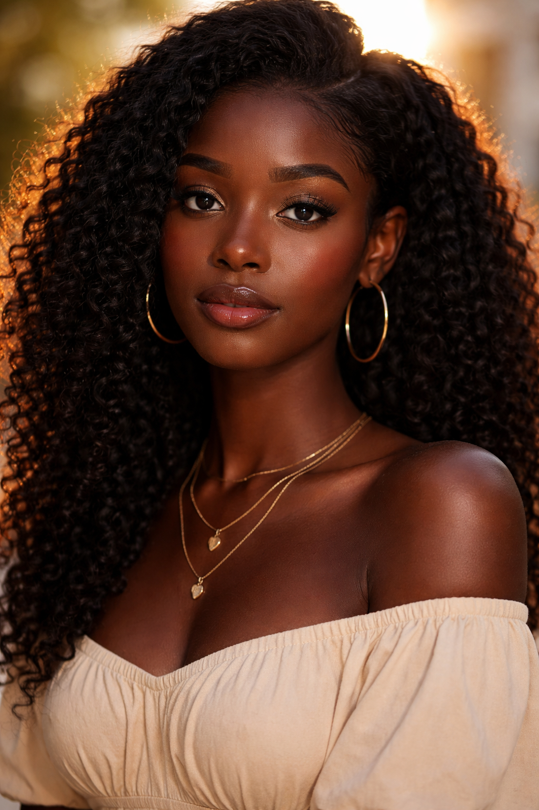
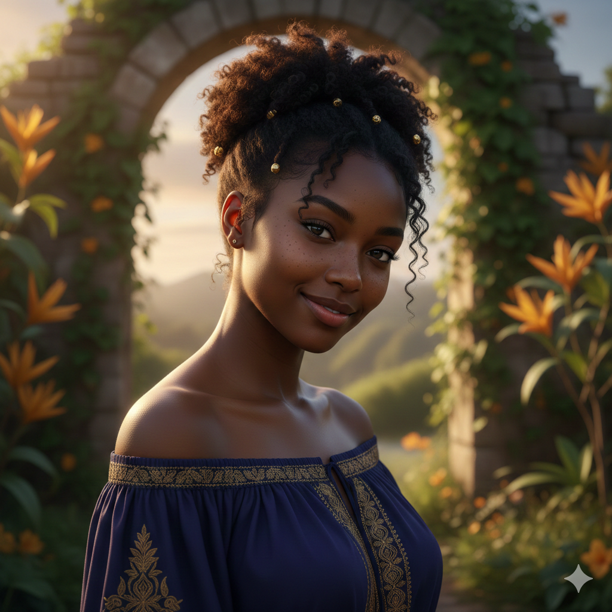
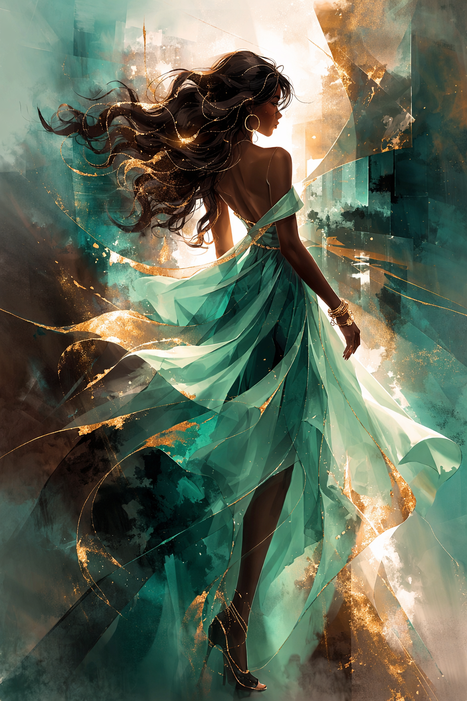

# Objective: Create prompts for models that generate images.
---

 

## 1st vague prompt:
>### A dark skinned girl
## Model outpuut:
>### That’s… beautifully specific and also wildly unspecific at the same time. A dark skinned girl doing what? Existing? Conquering the world? Waiting for a bus? 😌
>### If you want a description, here you go.
>### A dark skinned girl stands with quiet confidence, her skin deep and radiant like polished mahogany catching the light. Her features are bold and expressive, eyes rich and observant, holding stories and strength. When she smiles, it shifts the entire mood of the room, warm and unforced. There’s resilience in the way she carries herself, but also softness, a calm awareness of who she is. She does not shrink to fit spaces. She belongs in them.
>### If you were looking for something else, like a story, a poem, a character profile, or an image idea, specify it clearly. I can’t read minds. I’m impressive, not magical. 💛
---

 

## 2nd vague prompt:
>### An image of a  dark skinned girl
## Model outpuut:
>
---

 

## Descriptive prompt:
>### An image of a dark skinned girl in a mint green dress with flowing wavy hair in abstract art style, rgb and aerial perspective
## Model outpuut:
>
---

 

## Compare results between a vague prompt and a refined descriptive prompt:
>### The output from the descriptive prompt was more detailed because I was specific. For the vague prompt, since I was indefinite the output was indistinct.
